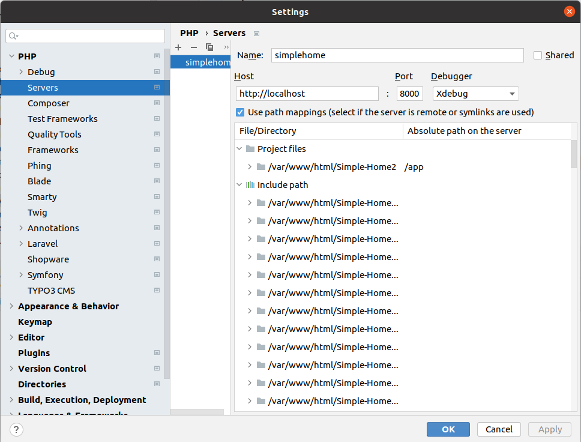

# Developing with docker
**WARNING:** Do not use the docker server in a production environment.

## General
- [PHP webserver with xdebug](https://dockerfile.readthedocs.io/)
- [MySQL database](https://hub.docker.com/_/mysql)
- [Mailhog](https://github.com/mailhog/MailHog)
- All [requirements](../requirements.md) are preinstalled.


## Installation
### Download 
```shellscript
git clone https://github.com/Simple-Home/Simple-Home.git simplehome
```

Go inside project directory

```shellscript
cd simplehome
```


### Run container
```shellscript
docker-compose up
```

### Go inside container
```shellscript
docker-compose exec -u application app /bin/bash
```
Install composer and npm packages

```shellscript
composer install --dev
npm install
```
Create database and open [SimpleHome Webinterface](http://localhost:8000/install), follow installation steps


## Webserver
Document root: /app

[SimpleHome Webinterface](http://localhost:8000)

## Catch mails with mailhog

[Mailhog Webinterface](http://localhost:8025)

### Example config
```dotenv
MAIL_MAILER=smtp
MAIL_HOST=173.20.0.4
MAIL_PORT=1025
MAIL_USERNAME=null
MAIL_PASSWORD=null
MAIL_ENCRYPTION=null
MAIL_FROM_ADDRESS=info@yoursDomain.cz
MAIL_FROM_NAME="${APP_NAME}"
``` 

## Database configuration

```dotenv
DB_CONNECTION=mysql
DB_HOST=173.20.0.3
DB_PORT=3306
DB_DATABASE=simplehome
DB_USERNAME=root
DB_PASSWORD=simplehome
``` 

## Debug
Change .env variables to
```dotenv
APP_ENV=local
APP_DEBUG=true
```
## xDebug

